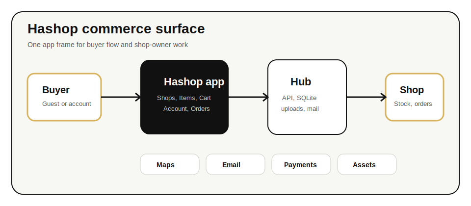

# Hashop Architecture

Last updated: 2026-05-31

Hashop is a single commerce application with two visible roles: buyer and shop owner. The same app frame supports both roles so the product stays easy to operate on a phone.



## Principles

- Buyer first: browsing and ordering must work without login.
- Owner ready: a buyer account can later manage one or more shops.
- One frame: avoid separate dashboards unless a hard product boundary requires one.
- Direct commerce: prioritize items, carts, orders, stock, location, and payment context.
- Reusable core: pure commerce and presentation helpers should move into small modules with tests before larger extraction work.

## Runtime Shape

| Layer | Current files | Responsibility |
| --- | --- | --- |
| Static shell | `tools/hashop_site/index.html` | App markup, build token, CSS and script ordering. |
| App behavior | `tools/hashop_site/home.js` | Buyer state, owner state, cart, order creation, maps, account UI, API calls. |
| UI correction layer | `tools/hashop_site/home-ui.css`, `tools/hashop_site/home-ui.js` | Final visual and text polish for the live home frame. |
| Commerce helpers | `tools/hashop_site/commerce-core.js` | Pure price, cart, and order-status helpers shared by browser and Node tests. |
| Polish helpers | `tools/hashop_site/home-polish-core.js` | Pure text cleanup and state-motion helper logic shared by browser and Node tests. |
| Public theme | `tools/hashop_site/public-theme.js` | Shared About and Privacy theme bootstrap. |
| Hub/API | `tools/hashop_hub.py` | aiohttp routes, SQLite persistence, mail, uploaded assets, static serving, and health checks. |
| Tests | `tools/hashop_tests/` | Guardrails for reusable JS helpers and Python auth behavior. |

## Data Model

| Object | Purpose |
| --- | --- |
| Buyer key | Local device key for guest orders and repeat history. |
| Buyer account | Optional server-backed identity for synced history and contact permanence. |
| Owner membership | Grants an account access to one or more shops. |
| Shop | Public storefront plus owner-managed profile, location, stock, payments, and orders. |
| Item | Product listing with title, description, price, quantity, image, and availability. |
| Cart | Buyer-side selection for one shop-specific order path. |
| Order | Server-side transaction record with buyer snapshot, items, payment mode, delivery or pickup context, and status. |

## Order Status Contract

Hashop normalizes order state to:

- `created`
- `payment_pending`
- `accepted`
- `ready`
- `paid`
- `completed`
- `cancelled`

The helper contract lives in `commerce-core.js`; keep order-status logic there before duplicating it in browser UI or backend adapters.

## Route Map

| Route | Handler purpose |
| --- | --- |
| `/` | Main app frame. |
| `/shops`, `/items`, `/cart`, `/account` | Deep links into app states. |
| `/setup` | Minimal account setup. |
| `/about` | Public objective page. |
| `/privacy`, `/policies` | Privacy and operating rules. |
| `/healthz` | Deployment health check. |
| `/api/meta` | Bootstrap metadata. |
| `/api/shops` | Shop list and creation. |
| `/api/items/library` | Public item library. |
| `/api/buyer/*` | Buyer signup, login, contact verification, session, and reset flows. |
| `/api/shops/{shop_id}/console` | Owner shop console read/write. |
| `/api/shops/{shop_id}/orders` | Order creation. |
| `/api/shops/{shop_id}/logo` | Shop logo upload and fetch. |
| `/api/shops/{shop_id}/items/{item_id}/image` | Item image upload. |
| `/api/shops/{shop_id}/payment-qr` | Payment QR upload. |

## Module Rules

Use these rules before adding new code:

- Put pure price, cart, payment-mode, and order-state helpers in `commerce-core.js`.
- Put cross-page public theme bootstrapping in `public-theme.js`.
- Put browser-only DOM behavior in `home.js` or `home-ui.js`.
- Put visual corrections in CSS before adding DOM wrappers.
- Add a Node test for every browser-safe helper.
- Keep `home.js` behavior changes small and route them through named helper functions.

## Build Tokens

Public HTML files carry cache-busting build tokens:

- Main app: `hashop-home-i###`
- Public pages: `hashop-public-i###`

When public assets change, update the token in the HTML and verify that the served HTML references the new token.

## Verification Checklist

Run this before shipping app or docs changes:

```bash
node --check tools/hashop_site/home.js
node --check tools/hashop_site/home-ui.js
node --check tools/hashop_site/home-polish-core.js
node --check tools/hashop_site/public-theme.js
node tools/hashop_tests/commerce-core.test.js
node tools/hashop_tests/home-polish-core.test.js
node tools/hashop_tests/public-theme.test.js
python -m py_compile tools/hashop_hub.py
python -m unittest tools/hashop_tests/auth_guardrails_test.py
git diff --check
```

For hosted changes, also verify:

```bash
curl -fsS https://hashop.in/healthz
curl -fsS https://hashop.in/ | rg "hashop-home-i"
curl -fsS https://hashop.in/about | rg "hashop-public-i"
```
