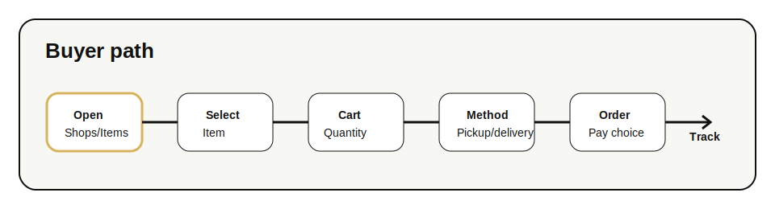
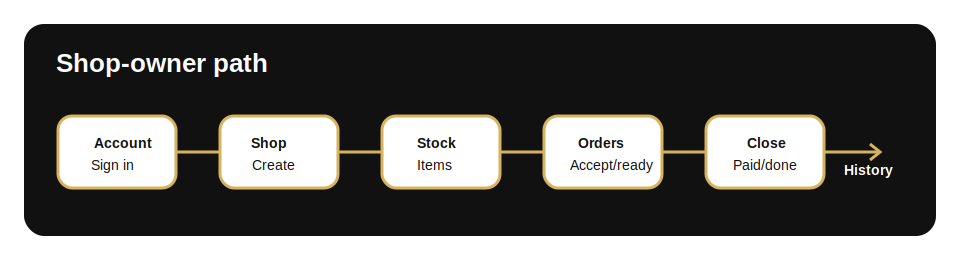

# Hashop End-to-End Tutorial

Last updated: 2026-05-31

This tutorial explains how to run Hashop locally, use it as a buyer, create a buyer account, add a shop, manage stock, and process orders.

## 1. Run Hashop Locally

From the repository root:

```bash
python tools/hashop_hub.py --public-base-url http://127.0.0.1:8080
```

Open:

```text
http://127.0.0.1:8080/
```

The app should open with the map, search field, listing pane, and bottom navigation.

## 2. Buyer Flow



1. Open `Shops` to browse nearby shops.
2. Use search to filter by shop name, item name, or location.
3. Open a shop or switch to `Items`.
4. Add an item to the cart.
5. Open `Cart`.
6. Adjust quantity if needed.
7. Choose pickup or delivery details when requested.
8. Choose payment mode:
   - `Pay on receive` for normal local handoff.
   - `Pay before` when the shop has a payment method configured.
9. Place the order.
10. Open `Account` to view recent orders when history exists.

Buyer login is optional. A guest can still place an order because Hashop stores a local buyer key on the device.

## 3. Buyer Account

Use a buyer account when the same person wants saved contact, synced history, or faster repeat orders.

1. Open `Account`.
2. Select the buyer sign-in or create-account path.
3. Enter contact details.
4. Complete contact verification if prompted.
5. Sign in.
6. Confirm that `Account` shows buyer settings and order access.

The buyer account must not replace shop ownership. Shop ownership is a separate role attached to the account.

## 4. Shop-Owner Flow



1. Open `Account`.
2. Choose the shop-owner path.
3. Add a shop if no owned shop exists.
4. Enter shop name, contact, and location.
5. Verify the contact when required.
6. Open the owned shop.
7. Use owner mode to manage:
   - `My shops` for registered shop access.
   - `Stock` for listed items.
   - `Orders` for incoming and historical orders.
   - `Account` for identity, role, support, and sign-out controls.

Owner mode should still feel like Hashop, not like a separate admin product.

## 5. Add or Edit Stock

In owner mode:

1. Open `Stock`.
2. Add or select an item.
3. Set title, description, price, quantity, and availability.
4. Add an item image when available.
5. Save changes.
6. Return to the buyer item view and confirm the item appears correctly.

Use contained product images. Avoid cropped or oversized product previews.

## 6. Payment Setup

A shop can support simple direct payment behavior.

1. Open the owned shop tools.
2. Add payment notes or payment method details.
3. Upload a payment QR when needed.
4. Test a buyer order with `Pay before`.
5. Confirm that the payment method appears only when payment is required.

Hashop does not require card vaulting for the core flow. The basic model supports pay on receive and direct shop-managed payment.

## 7. Order Handling

When an order arrives:

1. Open owner mode.
2. Open `Orders`.
3. Review buyer snapshot, item list, quantity, payment mode, and delivery or pickup context.
4. Mark the order through the expected statuses:
   - created
   - accepted
   - ready
   - paid
   - completed
5. Cancel only when the order should not be fulfilled.

For pickup, location cues should help the buyer reach the shop. For delivery, location cues should help the seller understand the delivery target.

## 8. Public Pages

Hashop includes public pages for product context and policies:

- `/about`
- `/privacy`
- `/policies`

These pages inherit the Hashop public theme and use the same logo, icon, and day/night preference as the app.

## 9. Operator Setup

For production-like testing, configure SMTP:

```bash
HASHOP_SMTP_HOST=smtp.resend.com
HASHOP_SMTP_PORT=587
HASHOP_SMTP_SECURITY=starttls
HASHOP_SMTP_USERNAME=resend
HASHOP_SMTP_PASSWORD=your-smtp-password
HASHOP_SMTP_FROM=no-reply@hashop.in
HASHOP_SMTP_FROM_NAME=Hashop
HASHOP_EXPOSE_RESET_CODES=0
```

Optional Google Maps:

```bash
HASHOP_GOOGLE_MAPS_API_KEY=your-google-maps-key
```

Run with explicit paths when operating outside the repository:

```bash
python tools/hashop_hub.py \
  --host 127.0.0.1 \
  --port 8080 \
  --public-base-url https://hashop.in \
  --site-dir tools/hashop_site \
  --shop-db tools/hashop.sqlite3 \
  --uploads-dir tools/hashop_uploads
```

## 10. Acceptance Checklist

Before calling a build ready:

- `Shops` loads without horizontal overflow.
- `Items` shows product-first cards or rows.
- `Cart` shows selected items, quantity controls, and a clear empty state.
- `Account` supports signed-out, buyer, and owner states.
- Owned shops remain visible after refresh and sign-in.
- Owner mode shows `My shops`, `Stock`, `Orders`, and `Account`.
- About and Privacy use the same public theme.
- Uploaded shop, item, and QR images render inside their frames.
- No important content is hidden behind the bottom navigation.
- The app remains usable on touch screens.
